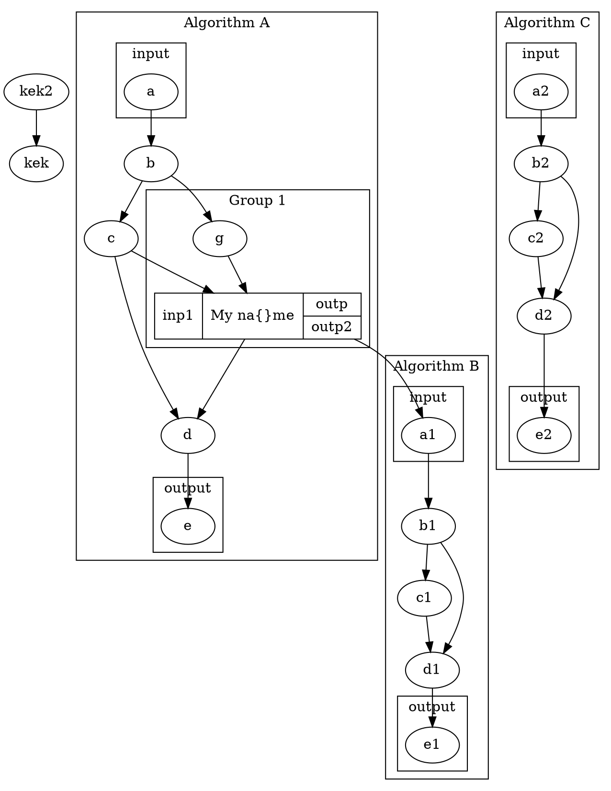
```graphviz
digraph G {
  
//      compound=true;

// b 
// a1
// a2

 //{
 //  rank=same
 //  b a1 a2
 //}

  "##foo#232" [label="kek"] 
  "##foo#233" [label="kek2"] 

  "##foo#233" -> "##foo#232"

  subgraph cluster_3 {
      label="Algorithm A"
      subgraph cluster_i {
          label="input"
        a
      }
      subgraph  {
          label=""
        b
        c
        d
        
        
        subgraph cluster_2 {
            label="Group 1"
            g
            h [shape="record", label="inp1|My na\{\}me|{outp|outp2}}"]
        }
        
      }
      
      subgraph cluster_o {
          label="output"
        e
      }
  }
  
  
  subgraph cluster_1 {
      label="Algorithm B"
      subgraph cluster_i {
          label="input"
        a1
      }
      subgraph cluser_0 {
          label=""
        b1
        c1
        d1
      }
      
      subgraph cluster_o {
          label="output"
        e1
      }
  }

  subgraph cluster_2 {
      label="Algorithm C"
      subgraph cluster_i1 {
          label="input"
        a2
      }
      subgraph cluser_01 {
          label=""
        b2
        c2
        d2
      }
      
      subgraph cluster_o1 {
          label="output"
        e2
      }
    
  }
  
  //edge [style=invis]
 // {b a1 a2} -> {c}


edge[style=vis]

  a->b
  b->c
  c->d
  d->e
  b -> g
  g -> h
  c->h
  h->d
  
  h->a1
  
  ///
  
  
  a1->b1
  b1->c1
  c1->d1
  d1->e1
  b1 -> d1


  a2->b2
  b2->c2
  c2->d2
  d2->e2
  b2 -> d2

//   [constraint=false;]
  
  
  //edge [style=invis]
 // {b a1 a2} -> {c}

      

}

```

## Provider

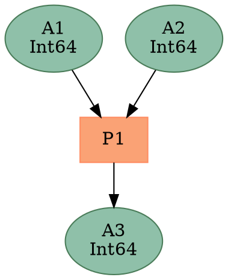
```graphviz
digraph { layout=dot; compound=true;
__provider_1 [shape="rectangle",label="P1",style="filled",color="#ff8c61",fillcolor="#faa275"]
__artifact_2 [label="A3\nInt64",shape="ellipse",style="filled",color="#4a7c59",fillcolor="#8fc0a9"]
__artifact_3 [label="A1\nInt64",shape="ellipse",style="filled",color="#4a7c59",fillcolor="#8fc0a9"]
__artifact_4 [label="A2\nInt64",shape="ellipse",style="filled",color="#4a7c59",fillcolor="#8fc0a9"]

__provider_1 -> __artifact_2
__artifact_3 -> __provider_1
__artifact_4 -> __provider_1
}
```

## Algorithm 1

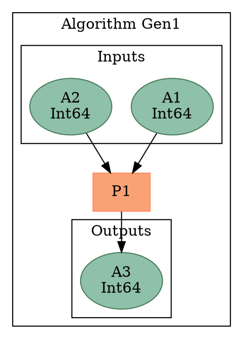
```graphviz
digraph { compound=true;
subgraph cluster_algorithm_1 {
label="Algorithm Gen1"
subgraph cluster_algorithm_1_inputs {
label="Inputs"
artifact_2 [label="A1\nInt64",shape="ellipse",style="filled",color="#4a7c59",fillcolor="#8fc0a9"]
artifact_3 [label="A2\nInt64",shape="ellipse",style="filled",color="#4a7c59",fillcolor="#8fc0a9"]
} // cluster_algorithm_1_inputs
subgraph cluster_algorithm_1_outputs {
label="Outputs"
artifact_4 [label="A3\nInt64",shape="ellipse",style="filled",color="#4a7c59",fillcolor="#8fc0a9"]
} // cluster_algorithm_1_outputs
provider_5 [shape="rectangle",label="P1",style="filled",color="#ff8c61",fillcolor="#faa275"]
} // cluster_algorithm_1

provider_5 -> artifact_4
artifact_2 -> provider_5
artifact_3 -> provider_5
}
```

## Algorithm 3
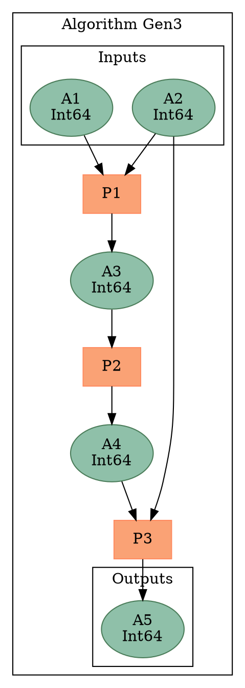
```graphviz
digraph { compound=true;
subgraph cluster_algorithm_1 {
label="Algorithm Gen3"
subgraph cluster_algorithm_1_inputs {
label="Inputs"
artifact_2 [label="A1\nInt64",shape="ellipse",style="filled",color="#4a7c59",fillcolor="#8fc0a9"]
artifact_3 [label="A2\nInt64",shape="ellipse",style="filled",color="#4a7c59",fillcolor="#8fc0a9"]
} // cluster_algorithm_1_inputs
subgraph cluster_algorithm_1_outputs {
label="Outputs"
artifact_4 [label="A5\nInt64",shape="ellipse",style="filled",color="#4a7c59",fillcolor="#8fc0a9"]
} // cluster_algorithm_1_outputs
provider_5 [shape="rectangle",label="P3",style="filled",color="#ff8c61",fillcolor="#faa275"]
artifact_6 [label="A4\nInt64",shape="ellipse",style="filled",color="#4a7c59",fillcolor="#8fc0a9"]
provider_7 [shape="rectangle",label="P1",style="filled",color="#ff8c61",fillcolor="#faa275"]
artifact_8 [label="A3\nInt64",shape="ellipse",style="filled",color="#4a7c59",fillcolor="#8fc0a9"]
provider_9 [shape="rectangle",label="P2",style="filled",color="#ff8c61",fillcolor="#faa275"]
} // cluster_algorithm_1

provider_5 -> artifact_4
artifact_6 -> provider_5
artifact_3 -> provider_5
provider_7 -> artifact_8
artifact_2 -> provider_7
artifact_3 -> provider_7
provider_9 -> artifact_6
artifact_8 -> provider_9
}
```

## Conditional
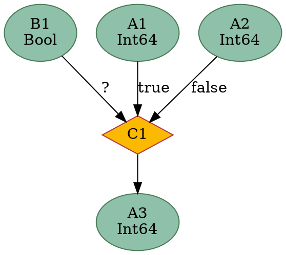
```graphviz
digraph { compound=true;
conditional_1 [shape="diamond",label="C1",style="filled",color="#b23a48",fillcolor="#fcb902"]
artifact_2 [label="B1\nBool",shape="ellipse",style="filled",color="#4a7c59",fillcolor="#8fc0a9"]
artifact_3 [label="A1\nInt64",shape="ellipse",style="filled",color="#4a7c59",fillcolor="#8fc0a9"]
artifact_4 [label="A2\nInt64",shape="ellipse",style="filled",color="#4a7c59",fillcolor="#8fc0a9"]
artifact_5 [label="A3\nInt64",shape="ellipse",style="filled",color="#4a7c59",fillcolor="#8fc0a9"]

artifact_2 -> conditional_1 [label="?"]
artifact_3 -> conditional_1 [label="true"]
artifact_4 -> conditional_1 [label="false"]
conditional_1 -> artifact_5
}
```

## Promote
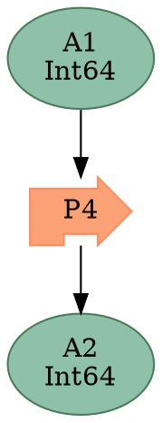
```graphviz
digraph { compound=true;
promote_1 [shape="rpromoter",label="P4",style="filled",color="#ff8c61",fillcolor="#faa275"]
artifact_2 [label="A2\nInt64",shape="ellipse",style="filled",color="#4a7c59",fillcolor="#8fc0a9"]
artifact_3 [label="A1\nInt64",shape="ellipse",style="filled",color="#4a7c59",fillcolor="#8fc0a9"]

promote_1 -> artifact_2
artifact_3 -> promote_1
}
```

## Group
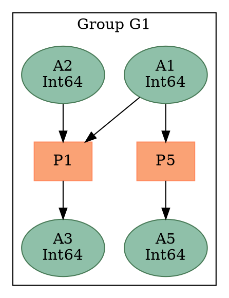
```graphviz
digraph { compound=true;
subgraph cluster_conditional_1 {
label="Group G1"
provider_2 [shape="rectangle",label="P1",style="filled",color="#ff8c61",fillcolor="#faa275"]
artifact_3 [label="A3\nInt64",shape="ellipse",style="filled",color="#4a7c59",fillcolor="#8fc0a9"]
artifact_4 [label="A1\nInt64",shape="ellipse",style="filled",color="#4a7c59",fillcolor="#8fc0a9"]
artifact_5 [label="A2\nInt64",shape="ellipse",style="filled",color="#4a7c59",fillcolor="#8fc0a9"]
provider_6 [shape="rectangle",label="P5",style="filled",color="#ff8c61",fillcolor="#faa275"]
artifact_7 [label="A5\nInt64",shape="ellipse",style="filled",color="#4a7c59",fillcolor="#8fc0a9"]
} // cluster_conditional_1

provider_2 -> artifact_3
artifact_4 -> provider_2
artifact_5 -> provider_2
provider_6 -> artifact_7
artifact_4 -> provider_6
}
```

## Unimplemented
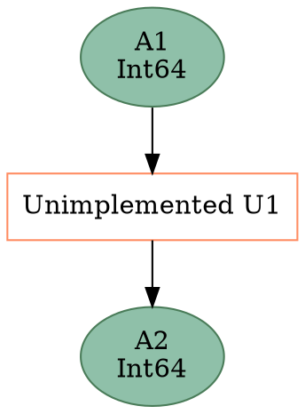
```graphviz
digraph { compound=true;
unimplemented_1 [shape="rectangle",label="Unimplemented U1",color="#ff8c61"]
artifact_2 [label="A2\nInt64",shape="ellipse",style="filled",color="#4a7c59",fillcolor="#8fc0a9"]
artifact_3 [label="A1\nInt64",shape="ellipse",style="filled",color="#4a7c59",fillcolor="#8fc0a9"]

unimplemented_1 -> artifact_2
artifact_3 -> unimplemented_1
}
```

## Invoke with
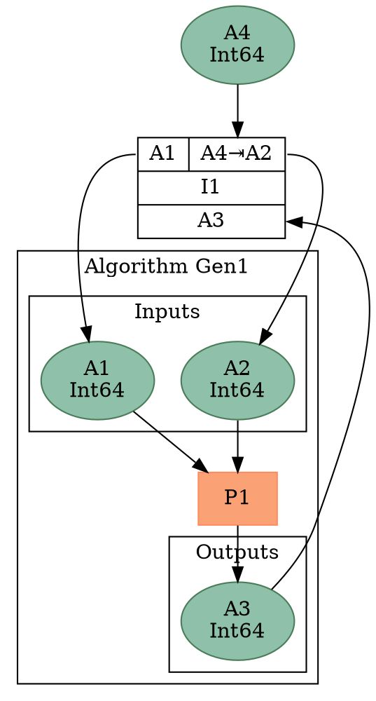
```graphviz
digraph { compound=true;
invoke_1 [shape="record",label="{{<invoke_1_input_2>A1|<invoke_1_input_3>A4⇥A2}|I1|{<invoke_1_output_4>A3}}"]
subgraph cluster_algorithm_5 {
label="Algorithm Gen1"
subgraph cluster_algorithm_5_inputs {
label="Inputs"
artifact_6 [label="A1\nInt64",shape="ellipse",style="filled",color="#4a7c59",fillcolor="#8fc0a9"]
artifact_7 [label="A2\nInt64",shape="ellipse",style="filled",color="#4a7c59",fillcolor="#8fc0a9"]
} // cluster_algorithm_5_inputs
subgraph cluster_algorithm_5_outputs {
label="Outputs"
artifact_8 [label="A3\nInt64",shape="ellipse",style="filled",color="#4a7c59",fillcolor="#8fc0a9"]
} // cluster_algorithm_5_outputs
provider_9 [shape="rectangle",label="P1",style="filled",color="#ff8c61",fillcolor="#faa275"]
} // cluster_algorithm_5
artifact_10 [label="A4\nInt64",shape="ellipse",style="filled",color="#4a7c59",fillcolor="#8fc0a9"]

provider_9 -> artifact_8
artifact_6 -> provider_9
artifact_7 -> provider_9
artifact_8 -> invoke_1:invoke_1_output_4
invoke_1:invoke_1_input_2 -> artifact_6
invoke_1:invoke_1_input_3 -> artifact_7
artifact_10 -> invoke_1:invoke_1_input_3
}
```

## Compound
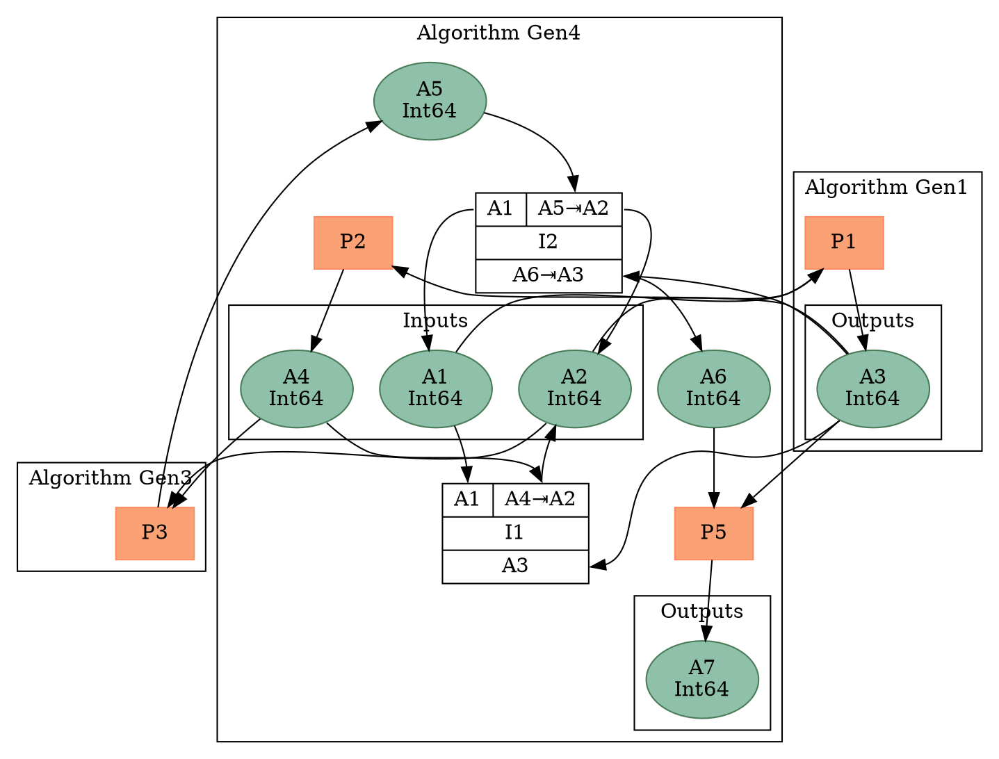
```graphviz
digraph { compound=true; 
subgraph cluster_algorithm_1 {
label="Algorithm Gen4"
subgraph cluster_algorithm_1_inputs {
label="Inputs"
artifact_2 [label="A1\nInt64",shape="ellipse",style="filled",color="#4a7c59",fillcolor="#8fc0a9"]
artifact_3 [label="A2\nInt64",shape="ellipse",style="filled",color="#4a7c59",fillcolor="#8fc0a9"]
artifact_4 [label="A4\nInt64",shape="ellipse",style="filled",color="#4a7c59",fillcolor="#8fc0a9"]
} // cluster_algorithm_1_inputs
subgraph cluster_algorithm_1_outputs {
label="Outputs"
artifact_5 [label="A7\nInt64",shape="ellipse",style="filled",color="#4a7c59",fillcolor="#8fc0a9"]
} // cluster_algorithm_1_outputs
invoke_6 [shape="record",label="{{<invoke_6_input_7>A1|<invoke_6_input_8>A4⇥A2}|I1|{<invoke_6_output_9>A3}}"]
invoke_13 [shape="record",label="{{<invoke_13_input_14>A1|<invoke_13_input_15>A5⇥A2}|I2|{<invoke_13_output_16>A6⇥A3}}"]
artifact_17 [label="A6\nInt64",shape="ellipse",style="filled",color="#4a7c59",fillcolor="#8fc0a9"]
artifact_18 [label="A5\nInt64",shape="ellipse",style="filled",color="#4a7c59",fillcolor="#8fc0a9"]
provider_19 [shape="rectangle",label="P2",style="filled",color="#ff8c61",fillcolor="#faa275"]
provider_20 [shape="rectangle",label="P5",style="filled",color="#ff8c61",fillcolor="#faa275"]

} // cluster_algorithm_1

subgraph cluster_algorithm_10 {
label="Algorithm Gen1"
subgraph cluster_algorithm_10_inputs {
label="Inputs"
} // cluster_algorithm_10_inputs
subgraph cluster_algorithm_10_outputs {
label="Outputs"
artifact_11 [label="A3\nInt64",shape="ellipse",style="filled",color="#4a7c59",fillcolor="#8fc0a9"]
} // cluster_algorithm_10_outputs
provider_12 [shape="rectangle",label="P1",style="filled",color="#ff8c61",fillcolor="#faa275"]
} // cluster_algorithm_10

subgraph cluster_algorithm_21 {
label="Algorithm Gen3"
subgraph cluster_algorithm_21_inputs {
label="Inputs"
} // cluster_algorithm_21_inputs
subgraph cluster_algorithm_21_outputs {
label="Outputs"
} // cluster_algorithm_21_outputs
provider_22 [shape="rectangle",label="P3",style="filled",color="#ff8c61",fillcolor="#faa275"]
} // cluster_algorithm_21

//edge [style=invis]
//{b a1 a2} -> {c}  


provider_12 -> artifact_11
artifact_2 -> provider_12
artifact_3 -> provider_12
artifact_11 -> invoke_6:invoke_6_output_9
//invoke_6:invoke_6_input_7 -> artifact_2
artifact_2 -> invoke_6:invoke_6_input_7 
invoke_6:invoke_6_input_8 -> artifact_3
artifact_4 -> invoke_6:invoke_6_input_8
artifact_11 -> invoke_13:invoke_13_output_16
invoke_13:invoke_13_output_16 -> artifact_17
invoke_13:invoke_13_input_14 -> artifact_2
invoke_13:invoke_13_input_15 -> artifact_3
artifact_18 -> invoke_13:invoke_13_input_15
provider_19 -> artifact_4
artifact_11 -> provider_19
provider_20 -> artifact_5
artifact_11 -> provider_20
artifact_17 -> provider_20
provider_22 -> artifact_18
artifact_4 -> provider_22
artifact_3 -> provider_22
}
```

## Test

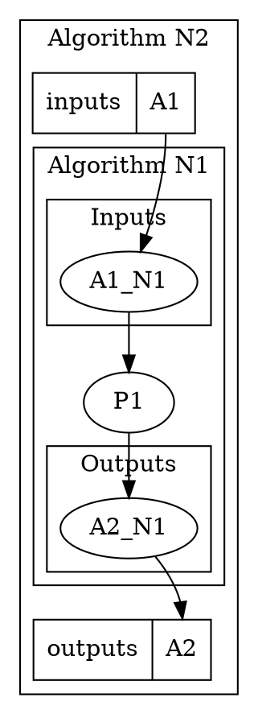
```graphviz
digraph { compound=true;

subgraph cluster_1 {
  label="Algorithm N2"
  cluster_1_inputs [shape="record", label="inputs|<cluster_1_inputs_1>A1"]
  
  cluster_1_outputs [shape="record", label="outputs|<cluster_1_outputs_1>A2"]

//}

subgraph cluster_4 {
  label="Algorithm N1"
  subgraph cluster_5 {
    label="Inputs"
    A1_N1
  }
  subgraph cluster_6 {
    label="Outputs"
    A2_N1
  }
  P1
}


}

A1_N1 -> P1
P1 -> A2_N1

{
cluster_1_inputs:cluster_1_inputs_1->A1_N1 //[minlen=3]
A2_N1->cluster_1_outputs:cluster_1_outputs_1 //[minlen=5]
}

//{A1} -> {A1_N1}

}
```